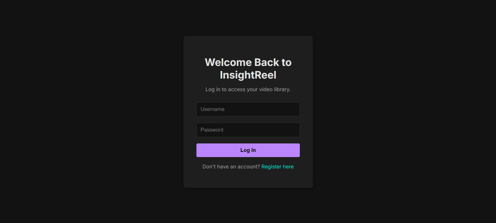
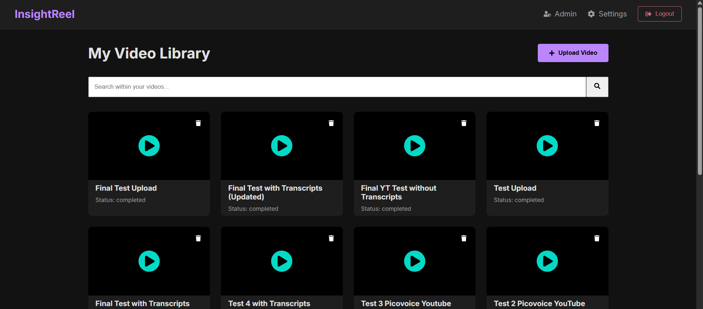
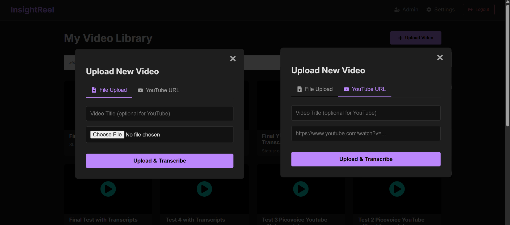
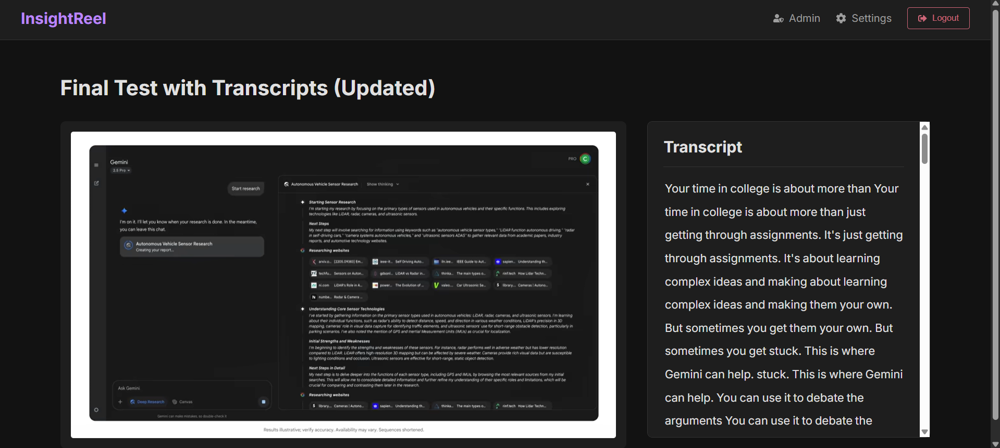
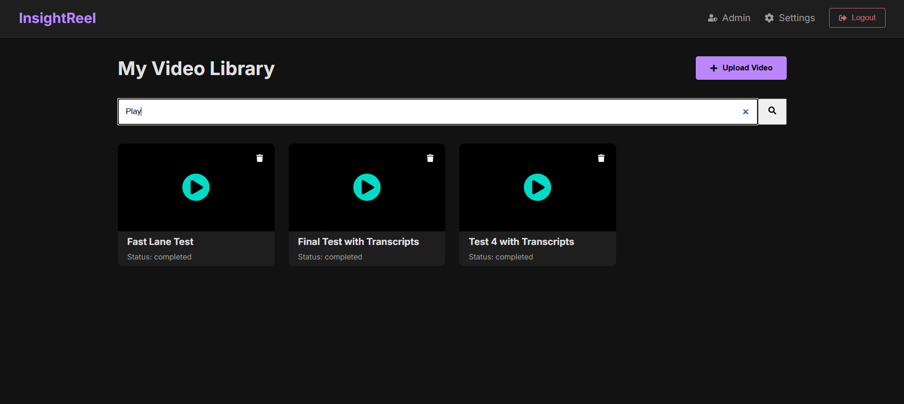
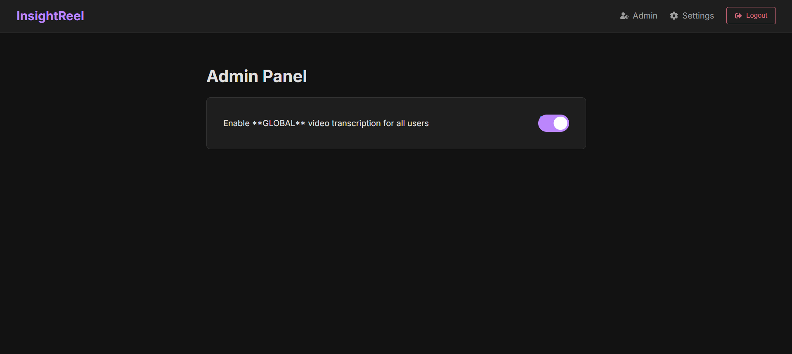

# 💡 InsightReel: Intelligent AI-Powered Video Library

**InsightReel** is an AI-driven video hosting and analysis platform that transforms long-form video content into a **searchable, interactive knowledge base**. Users can search any word or phrase spoken inside videos and jump directly to that exact timestamp.

**Live Demo:** [Link to the Deployed App](https://insightreel-frontend.vercel.app/)

---

## 🎯 Problem

Hours of valuable insights remain buried inside tutorials, lectures, and meetings. InsightReel solves this by unlocking every spoken word using **AI transcription and semantic search**, making content instantly accessible and searchable.

---

## ✨ Features

- **🎙️ AI-Powered Transcription:** Word-level, timestamped transcripts via **Picovoice Leopard**.  
- **🔗 YouTube Integration:**  
  - *Fast Lane* – fetch captions instantly via `yt-dlp`.  
  - *Fallback* – auto-download and transcribe audio when captions are unavailable.  
- **⬆️ Direct Uploads:** Secure uploads to **Backblaze B2** (S3-compatible).  
- **📄 Clickable Transcripts:** Interactive transcripts synced with playback.  
- **🔍 Deep Search:** Full-text transcript search using MongoDB `$text` index.  
- **🎥 Custom Video Player:** Highlights words as they’re spoken.  
- **🔐 Authentication:** JWT-secured user accounts.  
- **🗑️ CRUD Support:** Upload, search, view, and delete videos.  
- **☁️ Cloud-Native Deployment:** Optimized for Render (backend) and Vercel (frontend).  

---

## 🧱 Tech Stack

| Layer | Technology |
|-------|-------------|
| **Frontend** | React (Vite), React Router, Axios, React Hot Toast |
| **Backend** | Node.js, Express.js |
| **Database** | MongoDB Atlas |
| **Storage** | Backblaze B2 |
| **AI Engine** | Picovoice Leopard |
| **Media Tools** | FFmpeg, `yt-dlp` |
| **Deployment** | Render & Vercel (Monorepo Setup) |

---

## ⚙️ Setup

### Prerequisites
- Node.js (v18+), npm  
- MongoDB Atlas account  
- YouTube Data API key  
- Picovoice Access Key  
- Backblaze B2 credentials  
- `ffmpeg` & `yt-dlp` installed locally  

### 1. Clone Repository
```bash
git clone https://github.com/YourUsername/InsightReel.git
cd InsightReel
```

### 2. Backend Setup
```bash
cd backend
npm install
```
Create `.env`:
```bash
MONGO_URI=<your_mongo_uri>
JWT_SECRET=<your_jwt_secret>
YOUTUBE_API_KEY=<your_youtube_api_key>
PICOVOICE_ACCESS_KEY=<your_picovoice_key>
B2_KEY_ID=<your_b2_key_id>
B2_APP_KEY=<your_b2_app_key>
B2_BUCKET_NAME=<your_b2_bucket>
B2_ENDPOINT=https://s3.<region>.backblazeb2.com
PORT=5001
```
Run:
```bash
npm start
```

### 3. Frontend Setup
```bash
cd ../frontend
npm install
```
Create `.env`:
```bash
VITE_API_BASE_URL=http://localhost:5001/api
```
Run:
```bash
npm run dev
```

---

## 🚀 Deployment

1. **MongoDB Text Index**  
   Create a Text Index on `fullTranscript` in your `videos` collection.

2. **Render (Backend)**  
   - Root: `backend`  
   - Runtime: Docker  
   - Add `.env` variables  
   - Note backend URL (e.g., `https://insightreel-backend.onrender.com/api`)

3. **Vercel/Render (Frontend)**  
   - Root: `frontend`  
   - Build: `npm run build`  
   - Publish: `dist`  
   - Env: `VITE_API_BASE_URL=<backend_url>`  
   - Rewrite rule:  
     ```
     Source Path: /*
     Destination Path: /index.html
     ```

---

## 🖼️ Screenshots

| Login | Dashboard |
|-------|-----------|
|  |  | 

| Upload | Player |
|--------|--------|
|  |  | 

| Search | Admin |
|--------|--------|
|  |  |

---

## 🤝 Contributing
Contributions and feature suggestions are welcome — open an issue or pull request.

## 📄 License
Licensed under the **MIT License**.

---

**Built with ❤️ by Yash Jain**
